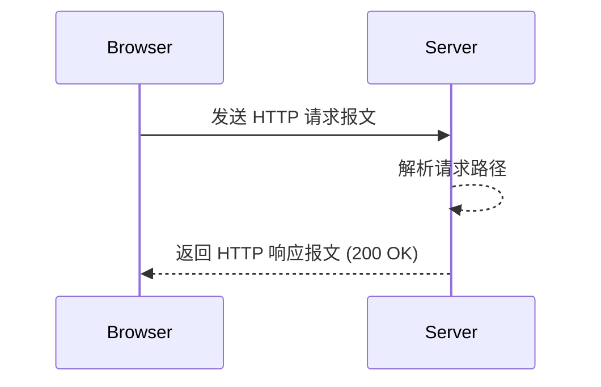

## 为什么要手写 HTTP 服务器？

现代 Java 开发极度依赖 Spring Boot 等框架，很多开发者对底层的网络协议和多线程处理其实并不清晰。通过手写一个建议的服务器，我们将能够清晰地理解：

1. **Socket 的工作原理**：如何接收请求，如何返回响应。
2. **HTTP 协议解析**：请求行、请求头、请求体的格式。
3. **多线程/线程池**：如何使用线程池处理高并发请求。

```java
import java.net.ServerSocket;
import java.net.Socket;

public class SimpleHttpServer {
    public static void main(String[] args) throws Exception {
        ServerSocket server = new ServerSocket(8080);
        System.out.println("服务器启动，监听 8080 端口...");
        
        while (true) {
            Socket client = server.accept();
            // 处理请求
        }
    }
}
```

（这里是详细图文）



跟着我们一步步完成这个实战项目。完成后，请不要忘记在页面底部**标记为已读**！
