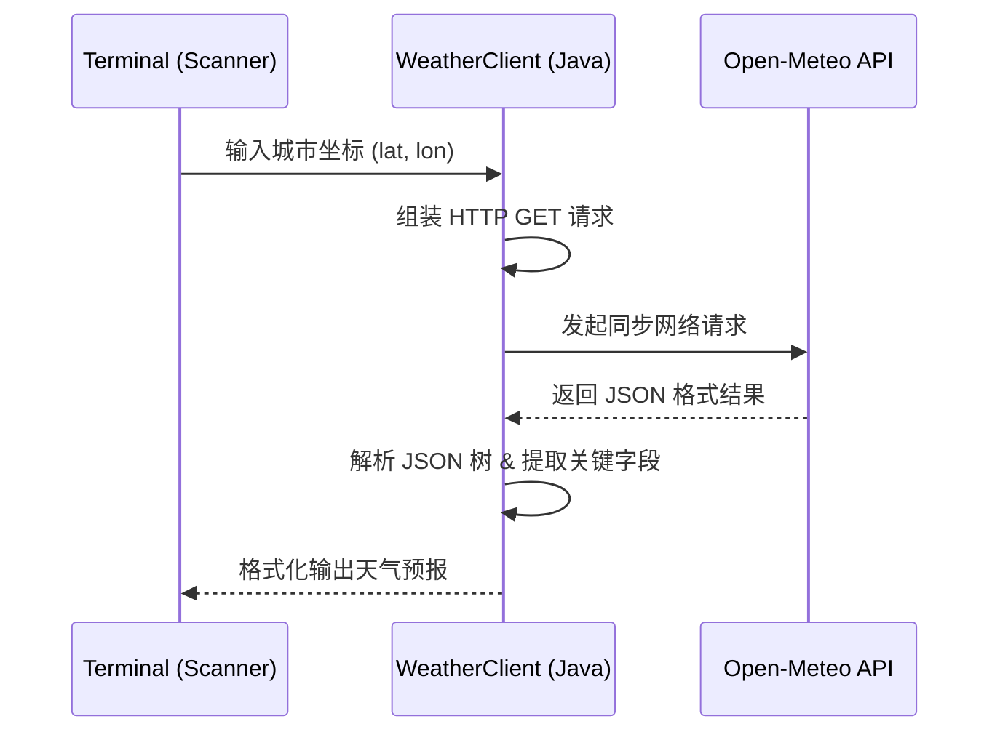

> **场景与痛点**：传统的第三方库封装往往掩盖了 HTTP 通信的本质，且初学者经常使用废弃的 `HttpURLConnection` 写出繁琐易错的代码。本节通过原生的 `java.net.http.HttpClient`，打造一个极简且坚固的天气查询命令行工具。

## ⚙️ 架构与数据流解构

当我们在终端输入城市名称，到底发生了什么？



## 💻 步步为营：手写核心逻辑

### 步骤 1：现代网络调用范式

从 Java 11 开始，原生内置了功能强大的 `HttpClient`。我们来创建一个工具类用于向天气 API (此处以开源免密钥的 Open-Meteo 为例) 获取数据：

```java
import java.net.URI;
import java.net.http.HttpClient;
import java.net.http.HttpRequest;
import java.net.http.HttpResponse;
import java.time.Duration;

public class WeatherClient {
    // 1. 初始化一个带有 10 秒超时限制的 Client
    private static final HttpClient client = HttpClient.newBuilder()
            .connectTimeout(Duration.ofSeconds(10))
            .build();

    public static String fetchWeatherData(double lat, double lon) throws Exception {
        // 2. 构造 API URL (以获取温度和风速为例)
        String url = String.format(
            "https://api.open-meteo.com/v1/forecast?latitude=%.2f&longitude=%.2f&current_weather=true",
            lat, lon
        );

        // 3. 构建 HTTP GET 请求
        HttpRequest request = HttpRequest.newBuilder()
                .uri(URI.create(url))
                .timeout(Duration.ofSeconds(5)) // 读超时
                .GET()
                .build();

        // 4. 发送请求并获取字符串响应
        HttpResponse<String> response = client.send(request, HttpResponse.BodyHandlers.ofString());

        if (response.statusCode() != 200) {
            throw new RuntimeException("API 请求失败，状态码: " + response.statusCode());
        }

        return response.body();
    }
}
```

### 步骤 2：手撕 JSON 而非完全依赖反序列化

为了更深入地理解数据结构，我们可以先利用 Java 内部的 `String` 构建基础，或使用极小的解析工具如 `org.json` 来手工拾取。但现代项目中，最常见的是直接将 JSON 映射到 **Record 控制类**（Java 14 引入的强大特性）。不过在这里，为了降低认知负荷，我们直接操作文本切片或极简解析（演示精简版字符串提权）：

```java
// 核心演示: 粗暴但有效的正则提取 (仅作理解用，生产环境请使用 Jackson/Gson)
public static String parseTemperature(String jsonResponse) {
    // response 类似于 {"current_weather": {"temperature": 23.5, ...}}
    String marker = "\"temperature\":";
    int index = jsonResponse.indexOf(marker);
    if (index == -1) return "未知";

    int startIndex = index + marker.length();
    int endIndex = jsonResponse.indexOf(",", startIndex);
    return jsonResponse.substring(startIndex, endIndex).trim();
}
```

### 步骤 3：交互式入口

结合 `Scanner`，完成最后的终端循环：

```java
import java.util.Scanner;

public class Application {
    public static void main(String[] args) {
        Scanner scanner = new Scanner(System.in);
        System.out.println("🌩 极验天气查询 (键入 'q' 退出)");

        while (true) {
            System.out.print("请输入纬度 (如 31.23): ");
            String input = scanner.nextLine();
            if ("q".equalsIgnoreCase(input)) break;

            try {
                double lat = Double.parseDouble(input);
                System.out.print("请输入经度 (如 121.47): ");
                double lon = Double.parseDouble(scanner.nextLine());

                System.out.println("正在向卫星获取数据...");
                String rawJson = WeatherClient.fetchWeatherData(lat, lon);
                String temp = parseTemperature(rawJson);

                System.out.println(">> 当前气温: " + temp + "°C\n");
            } catch (NumberFormatException e) {
                System.err.println("❌ 获取失败: 坐标格式不正确！");
            } catch (Exception e) {
                System.err.println("❌ 抱歉，获取天气数据时出现问题：" + e.getMessage());
            }
        }
    }
}
```

## 🛡 韧性与异常边界 (Resilience)

在真实的网络环境中，**“一切依赖外部的网络调用都可能失败”**。如果你没有在调用处加锁或超时限制，你的应用就会在这里死等。
所以我们在上面的 HTTP Client 中：

1. `connectTimeout(...)`：如果不写，API 服务器宕机时，你的应用将陷入长达数分钟的同步阻塞池中。
2. 捕获 `Exception` 并向用户提供清晰失败信息。

## ⚠️ 避坑说明 (Post-mortem)

- **忌用字符串拼接 `+` 生成大量 JSON**：如果必须自己构造 JSON 响应或反序列化，务必使用成熟框架（Gson、Jackson）。手工使用 Regex 提取仅限本节演示概念用。
- **资源泄露**：`Scanner` 未经包裹可以不显式关闭，但在正式处理文件流时，绝不可遗忘 `try-with-resources`！将在下一讲实战详述。

---

## 🎯 本章小结

通过本项目，你掌握了：

- 使用 Java 11+ 原生 `HttpClient` 发起现代化网络请求，告别过时的 `HttpURLConnection`。
- 理解 HTTP `GET` 请求的构建、超时控制与状态码校验。
- JSON 文本的基础解析思路（生产环境请使用 Jackson/Gson）。
- 网络调用的异常处理范式：超时防护、用户友好的错误提示。

📦 **完整源码参考**：[GitHub - Silio/project-01-weather-cli](https://github.com/woodynew/Silio)

➡️ **下一篇**：[实战二：简易 Markdown 到 HTML 转换器](/tutorials/java-basics/project-02-markdown-parser/) — 深入文件 IO 流与正则表达式。
