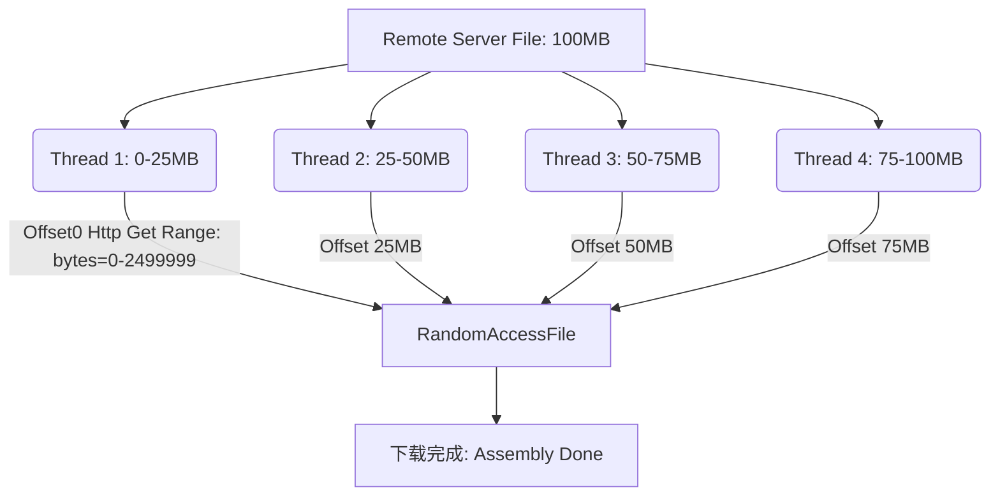

> **场景与痛点**：为什么百度网盘能满带宽下载？因为物理网络的传输瓶颈常常单线程无法打满。我们将利用 HTTP 的 `Range` 头和 Java 的多线程与随机写入，在本地拼装出一部电影。这不仅是并发实战，更是计算机网络中分块传输协议的最鲜活演示。

## ⚙️ 断点续传与多线程切块架构

如何将 100MB 切分为 4 个线程分别发力？



## 💻 步步为营：高并发提速实践

### 步骤 1：获取服务端支持与内容大小

我们需要先发送一个 `HEAD` 请求，或者截取 `Content-Length` 判断文件多大：

```java
import java.net.URI;
import java.net.http.HttpClient;
import java.net.http.HttpRequest;
import java.net.http.HttpResponse;

public class DownloadManager {
    public static long getFileSize(String fileUrl) throws Exception {
        HttpClient client = HttpClient.newHttpClient();
        HttpRequest request = HttpRequest.newBuilder(URI.create(fileUrl))
                // HTTP HEAD 请求只获取响应头，不拉取体积庞大的 body
                .method("HEAD", HttpRequest.BodyPublishers.noBody())
                .build();

        HttpResponse<Void> response = client.send(request, HttpResponse.BodyHandlers.discarding());
        String contentLength = response.headers().firstValue("Content-Length").orElse("0");
        return Long.parseLong(contentLength);
    }
}
```

### 步骤 2：下载分块的核心动作

这里用到了 `RandomAccessFile`：它可以从文件的**任意字节位置**开始写。就像修路一样，四个施工队可以直接到路的不同节点同步铺设沥青。

```java
import java.io.InputStream;
import java.io.RandomAccessFile;
import java.net.HttpURLConnection;
import java.net.URL;

public class DownloadTask implements Runnable {
    private String downloadUrl;
    private long startPos;
    private long endPos;
    private String localPath;

    public DownloadTask(String downloadUrl, long startPos, long endPos, String localPath) {
        this.downloadUrl = downloadUrl;
        this.startPos = startPos;
        this.endPos = endPos;
        this.localPath = localPath;
    }

    @Override
    public void run() {
        try {
            HttpURLConnection conn = (HttpURLConnection) new URL(downloadUrl).openConnection();
            // 核心网络协议：Range 请求！
            conn.setRequestProperty("Range", "bytes=" + startPos + "-" + endPos);

            try (InputStream in = conn.getInputStream();
                 RandomAccessFile raf = new RandomAccessFile(localPath, "rw")) {

                // 将写指针拨动到该线程负责的起始段
                raf.seek(startPos);

                byte[] buffer = new byte[8192];
                int len;
                // 从网络流读出来的，写入本地对应的偏移位置
                while ((len = in.read(buffer)) != -1) {
                    raf.write(buffer, 0, len);
                }
                System.out.println("✅ 一块防线施工完毕: " + startPos + " - " + endPos);
            }
        } catch (Exception e) {
            e.printStackTrace(); // 真实环境需要重试和容错处理
        }
    }
}
```

### 步骤 3：统筹调度线程池与闭锁等待

Java `ExecutorService` 负责出具线程，`CountDownLatch` 用于协调大部队的结束点：

```java
import java.util.concurrent.CountDownLatch;
import java.util.concurrent.ExecutorService;
import java.util.concurrent.Executors;

public class ConcurrencyDownloader {
    public static void start(String url, String localPath, int threadCount) throws Exception {
        long fileSize = DownloadManager.getFileSize(url);
        System.out.println("文件总大小: " + fileSize + " 字节");

        long partSize = fileSize / threadCount;

        ExecutorService pool = Executors.newFixedThreadPool(threadCount);
        CountDownLatch latch = new CountDownLatch(threadCount); // 闭锁，用于等待所有人

        for (int i = 0; i < threadCount; i++) {
            long startPos = i * partSize;
            // 最后一块要负责扫尾，吃到 fileSize 末尾
            long endPos = (i == threadCount - 1) ? fileSize : (startPos + partSize - 1);

            // 每一个线程都被包装了闭锁倒数动作
            pool.submit(() -> {
                new DownloadTask(url, startPos, endPos, localPath).run();
                latch.countDown(); // 完成一个，扣减一次
            });
        }

        latch.await(); // 主线程在这里死等，直到 countdown 被清零
        pool.shutdown();
        System.out.println("🎉 下载大胜利：所有分块组装完毕！");
    }
}
```

## 🛡 韧性与异常边界 (Resilience)

**网速的魔鬼在于不稳定。**
如果其中一个线程的 Http 流 `SocketTimeout` 断开，怎么进行残块重试？
专业的多线程下载器绝不会简单打印一把 `printStackTrace`！我们需要记录每个线程的真实写入指针 `currentPos`。只有把这个 `currentPos` 高可用地保存在本地 `.cfg` 中。哪怕断电重启，也能提取出断点，真正实现**断点续传**（这也是为何你在迅雷下载根目录总能看到临时文件的原因）。

## ⚠️ 避坑说明 (Post-mortem)

- **线程越多越快吗？**：并非如此！多线程下载突破的是服务端的单 TCP 限流或本地网卡的滑动窗口迟滞。如果是本地 CPU或磁盘 I/O 打满（比如你在机械硬盘中），100 个线程会产生极高的“磁道寻址等待”，速度甚至不如单线程！这就解释了为什么现代流处理更推崇单线程事件循环。

---

## 🎯 本章小结

通过本项目，你掌握了：
- HTTP `Range` 请求头实现文件分块下载的网络协议原理。
- `RandomAccessFile` 随机写入机制：多线程各自负责不同偏移段。
- `ExecutorService` 线程池管理与 `CountDownLatch` 闭锁同步。
- 断点续传的设计思路：记录写入指针实现故障恢复。

📦 **完整源码参考**：[GitHub - Silio/project-03-concurrent-downloader](https://github.com/woodynew/Silio)

➡️ **下一篇**：[实战四：高性能本地缓存框架](/tutorials/java-basics/project-04-local-cache/) — 并发安全的内存数据管理。
