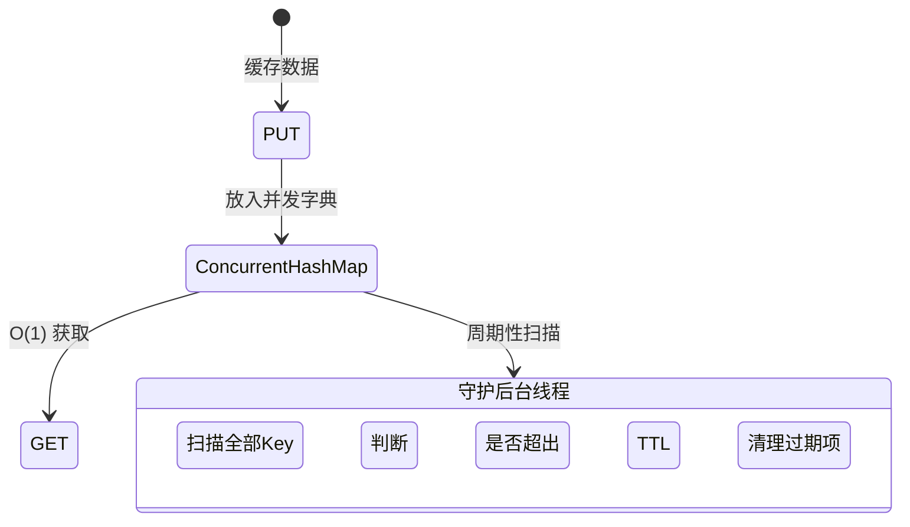

> **场景与痛点**：数据库查询慢？引入缓存是解决并发压力的第一步！但直接使用 `HashMap` 作为缓存容器，不仅在多线程下会报错死锁，更致命的是它会导致 OutOfMemoryError（因为数据只进不出）。我们将打造一个专业的缓存底座，它自己就能定期删掉过期数据。

## ⚙️ 缓存清理生命周期

为什么我们要守护内存的物理极限？



## 💻 步步为营：高可用的内存守护者

### 步骤 1：基础的并发包围网与泛型设计

用简单的 `public Object get(String key)` 太低级了。现代 Java 的精髓在于泛型（Generics）：

```java
import java.util.concurrent.ConcurrentHashMap;

// T 代表期望取得的类型，让调用方免去强制转型的烦恼
public class SilioCache<T> {

    // 我们必须封装一个内部类，记录插入时间和存活时间(毫秒)
    private static class CacheObject<T> {
        T value;
        long expireAt; // 绝对时间戳：过期时间

        CacheObject(T value, long ttlInMillis) {
            this.value = value;
            this.expireAt = System.currentTimeMillis() + ttlInMillis;
        }

        boolean isExpired() {
            return System.currentTimeMillis() > expireAt;
        }
    }

    // 核心引擎：高并发防线 ConcurrentHashMap
    private final ConcurrentHashMap<String, CacheObject<T>> map = new ConcurrentHashMap<>();

    public void put(String key, T value, long ttlInMillis) {
        map.put(key, new CacheObject<>(value, ttlInMillis));
    }
}
```

### 步骤 2：惰性删除（Lazy Deletion）

最经典的服务器策略：懒惰。也就是当你在请求查询 (`get`) 时，我才顺便看一眼它坏没坏：

```java
    public T get(String key) {
        CacheObject<T> obj = map.get(key);
        if (obj == null) {
            return null; // 不命中
        }

        if (obj.isExpired()) {
            map.remove(key); // 惰性：拿出来发现过期了，顺带从容器里物理清除
            return null;
        }

        return obj.value;
    }
```

### 步骤 3：驻留的守护线程（Active Deletion）

如果有些键值存放后永远都没有人来 `get` 它，惰性删除将形同虚设！它会永远卡在 `ConcurrentHashMap` 中耗尽内存。
因此我们需要一条永远死循环不挂断的**守护线程（Daemon Thread）**。

```java
    // 构造函数：诞生即启动死士线程！
    public SilioCache() {
        Thread cleanerThread = new Thread(() -> {
            while (true) {
                try {
                    Thread.sleep(5000); // 每 5 秒扫描一次全局
                    cleanUp();
                } catch (InterruptedException e) {
                    Thread.currentThread().interrupt();
                    break;
                }
            }
        });
        cleanerThread.setDaemon(true); // 声明为守护线程！（主流程结束，它跟着赴死，不阻碍 JVM 退出）
        cleanerThread.start();
    }

    private void cleanUp() {
        // 利用了 ConcurrentHashMap 支持多线程安全遍历的特性
        map.entrySet().removeIf(entry -> entry.getValue().isExpired());
    }
```

## 🛡 韧性与异常边界 (Resilience)

守护线程一定要加上 `setDaemon(true)`。
在 Java 虚拟机中，只要还有一个非守护线程（User Thread）运行，程序就不会彻底退出！如果你写成了普通的 `new Thread().start()`，即便你 `main` 方法跑完，你的终端也会依然恐怖地停留在那里！
这就是由于清理线程阻塞了虚拟机的终结信号。这也是并发初学者最常遭遇的程序卡死幽灵。

## ⚠️ 避坑说明 (Post-mortem)

- **为什么不用普通的 `HashMap`?**：`HashMap` 不是线程安全的。在 Java 7 及以下版本，并发修改会导致链表死循环从而引发 CPU 100% 飙升事故；即使在 Java 8+ 中改为红黑树导致数据丢失抛出 `ConcurrentModificationException`。
- **全局遍历清除的代价**：上文的 `removeIf` 将在键值多达上万时产生 O(N) 的 CPU 波动。在工业界引擎 (如 Guava Cache 或 Caffeine) 中，绝不会全局盲扫，而是运用分级定时器队列（TimingWheel）、LRU/LFU 淘汰算法来达到真正的微秒级延迟清理。

---

## 🎯 本章小结

通过本项目，你掌握了：
- 泛型 (`Generics`) 在缓存容器中的类型安全应用。
- `ConcurrentHashMap` 的并发安全特性与 `HashMap` 的致命区别。
- 惰性删除 (Lazy Deletion) 与主动扫描 (Active Deletion) 双重过期策略。
- 守护线程 (`Daemon Thread`) 的生命周期管理与 JVM 退出行为。

📦 **完整源码参考**：[GitHub - Silio/project-04-local-cache](https://github.com/woodynew/Silio)

➡️ **下一篇**：[实战五：轻量级数据库连接池](/tutorials/java-basics/project-05-connection-pool/) — 揭开中间件资源复用的底层面纱。
