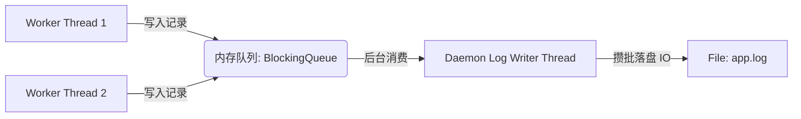

> **场景与痛点**：`System.out.println` 是最恶劣的生产代码。由于终端输出 / 文件落盘 是极其缓慢的 IO 动作，它甚至会利用底层操作系统的同步锁卡住主线程，导致你的每秒请求吞吐 (QPS) 暴跌。这就是为什么我们需要 `Logback` 或 `SLF4J` 等极速的异步队列日志系统。

## ⚙️ 异步隔离的高速引擎

将记录这一动作，从“马上干”转变为“丢信箱就走人”。



## 💻 步步为营：高性能吞吐隔离设计

### 步骤 1：日志事件级别枚举与抽象

```java
// 规定常见日志级别
public enum LogLevel {
    DEBUG, INFO, WARN, ERROR
}

// 需要被丢入列队的消息盒子对象
public class LogEvent {
    public LogLevel level;
    public String message;
    public long timestamp;
    public String threadName;

    public LogEvent(LogLevel level, String message) {
        this.level = level;
        this.message = message;
        this.timestamp = System.currentTimeMillis();
        this.threadName = Thread.currentThread().getName();
    }
}
```

### 步骤 2：日志分发异步底座

和我们在“缓存与连接池”篇中类似，依然要用一个极度坚韧的死士守护后台：

```java
import java.io.BufferedWriter;
import java.io.FileWriter;
import java.text.SimpleDateFormat;
import java.util.Date;
import java.util.concurrent.BlockingQueue;
import java.util.concurrent.LinkedBlockingQueue;

public class AsyncLogger {
    // 设置最大日志队列堆积容量。防止 OOM！
    private static final BlockingQueue<LogEvent> queue = new LinkedBlockingQueue<>(100_000);
    private static final String LOG_FILE = "system-trace.log";
    private static final SimpleDateFormat sdf = new SimpleDateFormat("yyyy-MM-dd HH:mm:ss.SSS");

    static {
        // 系统启动时立刻孵化一个物理的刷盘线程
        Thread writerThread = new Thread(() -> {
            try (BufferedWriter writer = new BufferedWriter(new FileWriter(LOG_FILE, true))) {
                while (true) {
                    // take() 动作：如果没有日志，就在这里永远睡觉，绝不空转耗尽 CPU
                    LogEvent event = queue.take();

                    String formattedLog = String.format("[%s] [%s] [%s] - %s",
                        sdf.format(new Date(event.timestamp)),
                        event.threadName,
                        event.level.name(),
                        event.message
                    );

                    writer.write(formattedLog);
                    writer.newLine(); // 系统换行
                    // 如果对速度有极致渴望，不要在这里强刷(flush)，而是等系统大批缓存后 flush。
                    // 极致吞吐下，应该按事件批次或隔一秒刷新一次. 这里为了可见性进行刷出：
                    writer.flush();
                }
            } catch (Exception e) {
                e.printStackTrace();
            }
        });

        writerThread.setDaemon(true); // 程序主逻辑结束即可关闭
        writerThread.start();
        System.out.println("🔧 后台异构日志基座就绪...");
    }

    // ⭐ 供业务代码调用的外部极速接口 (瞬间返回，绝不受写硬盘速度惩罚！)
    public static void info(String message) {
        queue.offer(new LogEvent(LogLevel.INFO, message));
    }

    public static void error(String message) {
        queue.offer(new LogEvent(LogLevel.ERROR, message));
    }
}
```

### 步骤 3：压测主干

体会什么是没有任何延迟的吞吐体验：主线程只管填东西即可，即使有 1 万条。

```java
public class LogAppTest {
    public static void main(String[] args) throws InterruptedException {
        System.out.println("🚀 发起日志轰炸...");
        long start = System.currentTimeMillis();

        for (int i = 0; i < 10000; i++) {
            AsyncLogger.info("高频业务进行中... 交易编号 ID-" + i);
        }

        long end = System.currentTimeMillis();
        System.out.println("🕒 主纯业务处理仅仅耗时: " + (end - start) + " 毫秒"); // 基本在 < 50ms 收工

        // 稍微等待下让后台收尾慢慢刷盘写文件
        Thread.sleep(1000);
    }
}
```

## 🛡 韧性与安全隔离 (Resilience)

上面的 `LinkedBlockingQueue` 必须限制容量（我们设为了 `100,000`）。这被称为**背压 (Backpressure)**，或称为有界缓冲预防决流。
如果你不限制，假设你的 Java 后台写入日志的速度（生产消息）达到 每秒100万条，但你的廉价机械硬盘每秒钟充其量只能处理掉几千条 IO（消费消息）。这些写盘尚未执行的 `LogEvent` 类统统只能淤积并停滞堆死在这个队列所在的 JVM 核心堆物理内存里！这会在半小时后导致内存耗竭 (OOM)。只有使用队列阈值边界堵住主线程的疯狂喷发限制，才是合格工程设计。

## ⚠️ 避坑说明 (Post-mortem)

- **既然主线程结束，如果还有没落盘的被 Daemon 杀死了怎么办？**：这个问题直达工业界底座深处——这就是为什么真正的如 Logback 系统有一个庞大的 Graceful Shutdown Hook（优雅关机的安全锚点系统保护）。它会利用 `Runtime.getRuntime().addShutdownHook()` 在 Java 断气前卡死 JVM 一会会儿，去排空队列中还没吐入硬盘的重磅残留事件。有兴趣者可做进阶搜索。

---

## 🎯 本章小结

通过本项目，你掌握了：
- 生产者-消费者模型在日志系统中的典型应用。
- `LinkedBlockingQueue` 的 `take()`/`offer()` 阻塞语义。
- 背压 (Backpressure) 机制：有界队列防止内存溢出。
- Graceful Shutdown Hook 的必要性：确保进程退出前日志全部落盘。

📦 **完整源码参考**：[GitHub - Silio/project-07-custom-logger](https://github.com/woodynew/Silio)

➡️ **下一篇**：[实战八：简易 LSM-Tree KV 引擎](/tutorials/java-basics/project-08-kv-database/) — 探究数据库存储引擎的底层思想。
