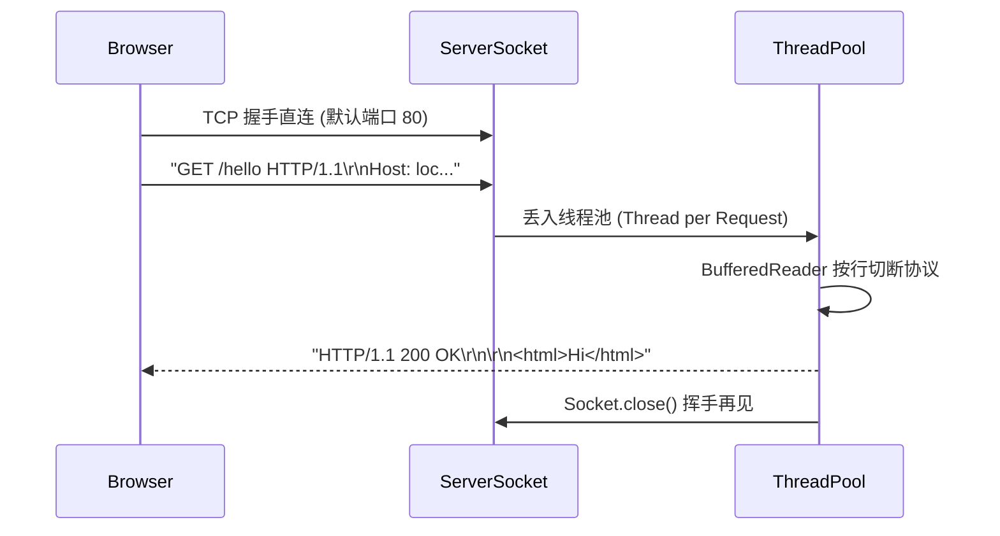

> **场景与痛点**：每一个 Java Web 开发者一上来就在写 Spring MVC 的 `@RestController`。但是，浏览器按下回车的那个 HTTP 请求，到底是怎样转变为 Java 里的一个方法的？它其实仅仅是一个极其朴素的 TCP Socket 传输了一段长得很像换行的字符串罢了。我们将带你手撕底层。

## ⚙️ 一个 HTTP 请求的解剖结构

浏览器到服务器中间没有魔法，只有纯文本。



## 💻 步步为营：破译 HTTP 协议

### 步骤 1：监听大门

所有 Web 服务器的入口，都是一个 `ServerSocket` 在死循环里“接客”。

```java
import java.net.ServerSocket;
import java.net.Socket;
import java.util.concurrent.ExecutorService;
import java.util.concurrent.Executors;

public class MiniTomcat {
    private static final int PORT = 8080;
    // 线程池：专门用来处理并行业务，防止一个人卡住排队的其他人
    private static final ExecutorService pool = Executors.newFixedThreadPool(50);

    public static void main(String[] args) throws Exception {
        try (ServerSocket serverSocket = new ServerSocket(PORT)) {
            System.out.println("🚀 迷你 Web 引擎已在端口 " + PORT + " 点火！");

            while (true) {
                // accept() 会阻塞，直到有浏览器来访问
                Socket clientSocket = serverSocket.accept();
                // 每来一个客人，马上丢给后厨做菜，前台立刻继续接客
                pool.submit(new HttpHandler(clientSocket));
            }
        }
    }
}
```

### 步骤 2：解构 HTTP 报文并进行路由调度

后厨（Handler 线程）如何将一坨英文字符还原成请求方法呢？

```java
import java.io.*;
import java.net.Socket;

public class HttpHandler implements Runnable {
    private final Socket clientSocket;

    public HttpHandler(Socket clientSocket) {
        this.clientSocket = clientSocket;
    }

    @Override
    public void run() {
        try (
            BufferedReader in = new BufferedReader(new InputStreamReader(clientSocket.getInputStream()));
            OutputStream out = clientSocket.getOutputStream();
            PrintWriter writer = new PrintWriter(out, true)
        ) {
            // 第一行一定是 Request Line: 比如 "GET /index.html HTTP/1.1"
            String requestLine = in.readLine();
            if (requestLine == null || requestLine.isEmpty()) return;

            String[] parts = requestLine.split(" ");
            String method = parts[0];
            String path = parts[1];

            System.out.println("-> 收到请求: [" + method + "] " + path);

            // 构建我们的路由系统
            String httpResponse;
            if ("/".equals(path)) {
                String html = "<h1>欢迎来到 Silio Java 手写引擎核心!</h1><p>这是一个完全原生的响应。</p>";
                httpResponse = buildResponse(200, "OK", html);
            } else if ("/api/ping".equals(path)) {
                String json = "{\"status\": \"UP\", \"message\": \"Pong!\"}";
                httpResponse = buildResponse(200, "OK", json);
            } else {
                httpResponse = buildResponse(404, "Not Found", "<h2>404 找不到该资源</h2>");
            }

            // 通过同一个管线原样冲回去给浏览器！
            writer.print(httpResponse);
            writer.flush();

        } catch (Exception e) {
            e.printStackTrace();
        } finally {
            // ⭐ 务必关闭！这就是无状态协议的特点（HTTP/1.0 时代）：拿完即走
            try { clientSocket.close(); } catch (IOException ignored) {}
        }
    }

    // ⭐ 按照 RFC 取出头部的组装规范: \r\n
    private String buildResponse(int code, String status, String body) {
        return "HTTP/1.1 " + code + " " + status + "\r\n" +
               "Content-Type: text/html; charset=UTF-8\r\n" +
               "Content-Length: " + body.getBytes().length + "\r\n" +
               "Server: SilioMiniTomcat/1.0\r\n" +
               "\r\n" +   // 这个空行极其致命，没有它，浏览器不认！
               body;
    }
}
```

### 步骤 3：实机验证启动

直接在终端或 IDE 启动 `MiniTomcat.java`。
翻开你的 Chrome 浏览器，访问：`http://localhost:8080/`
你将会神奇地看到一个 HTML 页面响应！访问 `/api/ping` 即可看到你的第一个原生 Web 后端。

## 🛡 韧性与异常边界 (Resilience)

上面的模型叫做 **Thread-per-request (每请求单线程模型)**。
这是早期主流的 Web 处理方案。只要客户端（浏览器）不调用 `Socket.close()`，这个 Handler 所在的工作线程就绝对不能去做别的事情。如果此时遭受 **Slowloris 慢速攻击**（黑客每十秒由于发半个字节，导致请求拖延极长不结束），那么你预先放在 `FixedThreadPool` 中的 50 个线程就会瞬间耗尽，其他正常买东西的用户将直接被拦在大门外超时 502！
为了解决这巨大的痛点，我们就不能用一对一守候的方法，而需要跨向下一节的终极实战：**基于事件循环的非阻塞 NIO 引擎**。

## ⚠️ 避坑说明 (Post-mortem)

- **为什么代码里手动添加 `\r\n` (回车换行)？** 这是因为 HTTP 协议起源自电传打字机时代，RFC2616 强制要求报文之间的头部必须由 `CRLF` (Carriage Return / Line Feed) 切割！如果你只写了 `\n`，那么老的浏览器或者严格的代理网关 (Nginx) 可能会直接掐断连接。

---

## 🎯 本章小结

通过本项目，你掌握了：
- `ServerSocket` + `accept()` 的 TCP 监听与连接建立过程。
- HTTP 报文的文本结构：Request Line、Headers、Body 的 `\r\n` 分隔规范。
- Thread-per-request 线程模型的工作原理及其并发瓶颈。
- Slowloris 慢速攻击的原理：为什么需要非阻塞 IO。

📦 **完整源码参考**：[GitHub - Silio/project-09-http-server](https://github.com/woodynew/Silio)

➡️ **下一篇**：[实战十：基于 NIO 的单线程高并发聊天室](/tutorials/java-basics/project-10-nio-chat/) — 终极进阶：事件驱动的网络引擎。
